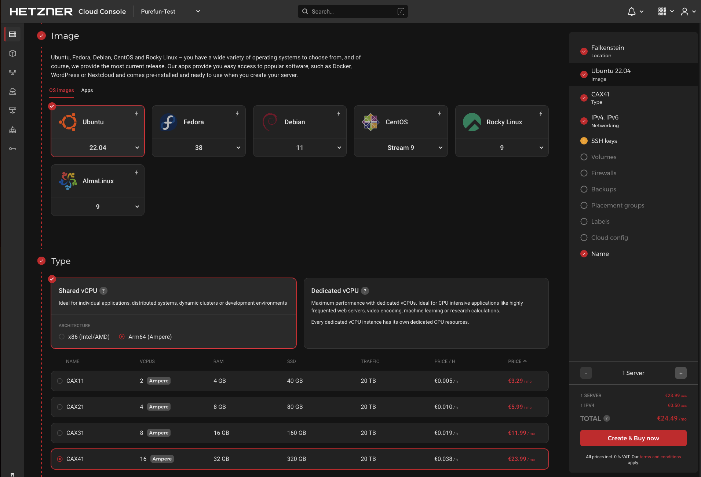
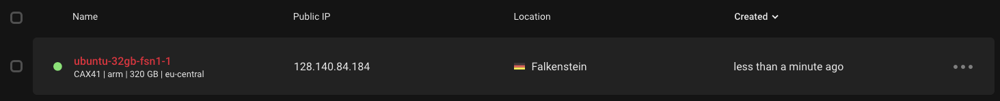
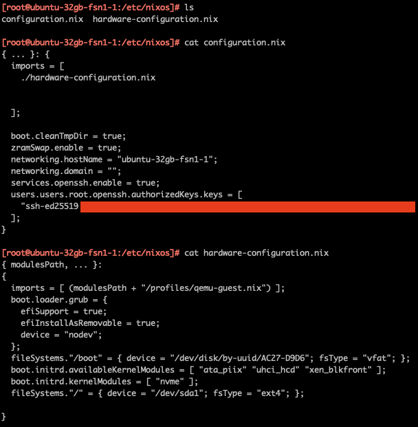

# Howto setup multi-user NixOS Build Machine

## Foreword

I'm going to show, how to set up remote multi-user NixOS Build Machine in the
cloud. Of course the instrcutions are also applicable to non-cloud setups.

TODO: Write more about hash-mismatches and problems content-addressed
derivations. I.e. explain a bit about the issue we are trying to solve.

We will use NixOS containers to setup multiple Nix Stores and nix-daemons on
the target machine.

## First create the server in the cloud and install NixOS

In this example, we will create a ARM64-based build machine on the Hetzner
Cloud. The instructions are also applicable to x86\_64-based systems and other
cloud providers.

From the Cloud Console, we just create basic Ubuntu 22.04 based machine,
because Hetzner does not provide NixOS base images for Cloud Servers.

When it has been created, we can log in using SSH.

    ssh root@128.140.84.184

And then as a first thing we will install NixOS to the machine using
[nixos-infect](https://github.com/elitak/nixos-infect). I suggest to read the
documentation for more advanced usecases, and the source code of the script to
understand what it does. For example you can specify channel and the NixOS
configuration to use, already when you run the nixos-infect.

Anyway, run the default installation command as specified in the above
nixos-infect README:

    curl https://raw.githubusercontent.com/elitak/nixos-infect/master/nixos-infect | NIX_CHANNEL=nixos-23.05 bash -x

The script will then install NixOS, and after installation it will reboot the
server into NixOS. After the machine has rebooted, you can log in again using
SSH.

    ssh root@128.140.84.184

As a first thing a recommend to delete the /old-root directory to free up some
disk space.

    rm -rf /old-root

Now you should be in a fully working NixOS system.

As you can see, the newly installed system already has some configuration in
place, generated by nixos-infect to match the cloud configuration of the
server.

TODO: Copy remote-builder.nix. Add to imports. nixos-rebuild switch.
